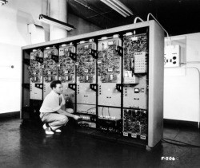

# Histoire

---

## 1940 : Traitement en Série

Un programmeur à la fois, un programme à la fois.  
Nécessite l'intervention humaine pour changer de programme.

  
---

## 1950 : Traitement par Lots

Introduction d'un programme {++moniteur++}, qui surveille les tâches en cours et permet d'enchainer automatiquement une liste de taches.

!!! abstract ""
    Chaque utilisateur soumet ses tâches à l’opérateur de l’ordinateur : cartes perforées, rubans magnétiques  
    Il y a un regroupement des tâches  
    Puis exécution séquentielle des regroupements  
    
    :fontawesome-solid-arrow-right: La fin d’une tâche est suivie par un branchement vers le moniteur.  
    :fontawesome-solid-arrow-right: Le moniteur charge en mémoire la tâche suivante et l’exécute dans le processeur  
    
    L’ordinateur est soit en exécution d’un programme utilisateur soit en exécution du programme moniteur

  
---

## 1950- 1960 : Traitement par Lots Multiprogrammés

L'amélioration logique consiste à exécuter une autre tâche dans les portions de temps où le processeur est inactif.   
Ceci exige la coopération du matériel.  

!!! abstract ""
     Apparition des interruptions matérielles & Module de gestion des interruptions :  
     :fontawesome-solid-arrow-right: Transfert rapide des données sans intervention du processeur.  
    
     Création d’un module de Memory Management :  
     :fontawesome-solid-arrow-right: maintenir en mémoire les tâches pour l’exécution.
    
     Création d’un module d’ordonnancement des tâches :  
     :fontawesome-solid-arrow-right: permet d’avoir plus d’une tâche en mémoire,  
     :fontawesome-solid-arrow-right: sélectionne l’une des tâches pour l’exécution.
 
!!! warning "Important !"
    **Traitement par lots = pas d’interactivité !**

  
---

## Début 1960 : Traitement en Temps Partagé
Une nouvelle technique doit être développée: le CTSS (Compatible Time-Sharing System) de MIT.

!!! abstract ""
    Blocage / Redémarrage périodique des tâches à l’aide d’une interruption cadencée par une source stable (CLK).  
    Chaque utilisateur du système est relié à l’ordinateur par le biais d’un terminal.  
    
    {== **Utilisateur = terminal = tâche** ==}  

!!! warning "Important !"
    Le processeur est contrôlé par chaque terminal durant une brève période de temps.  
    Ainsi, les tâches ont tour à tour l’attention du processeur (**round-robin**).
    
    Lorsqu’une tâche est en attente d’une opération E/S :  
    :fontawesome-solid-arrow-right: elle est immédiatement bloquée  
    :fontawesome-solid-arrow-right: le contrôle du processeur est passé à une autre tâche
    
|                           | Multi Programming                                             | Temps Partagé                                             |
| ------------------------- | ------------------------------------------------------------- | --------------------------------------------------------- |
| `Objectif`                | :material-check: Maximiser **l'utilisation du processeur**    |     :material-check: Minimiser le **Temps de Réponse**    |
| `Source des Commandes `   | Job Control Language (JCL)                                    | Commandes interactives via le Terminal                    |

  
---

## 1965 ~ : Multi-tâches et multi-utilisateur 

!!! success
    Association du **Multi-tache** (multi-programmation) + **Multi-Utilisateur** (temps partagé) : MULTICS.  
    En ajoutant un {==**Système de Gestion de Fichiers (SGF)**==}, on a déjà la structure d'un SE Moderne :muscle: !

  
---

## Pour résumer en Vidéo

<iframe width="560" height="315" src="https://www.youtube.com/embed/bdSWj7Y50VY" frameborder="0" allow="accelerometer; autoplay; clipboard-write; encrypted-media; gyroscope; picture-in-picture" allowfullscreen></iframe>

