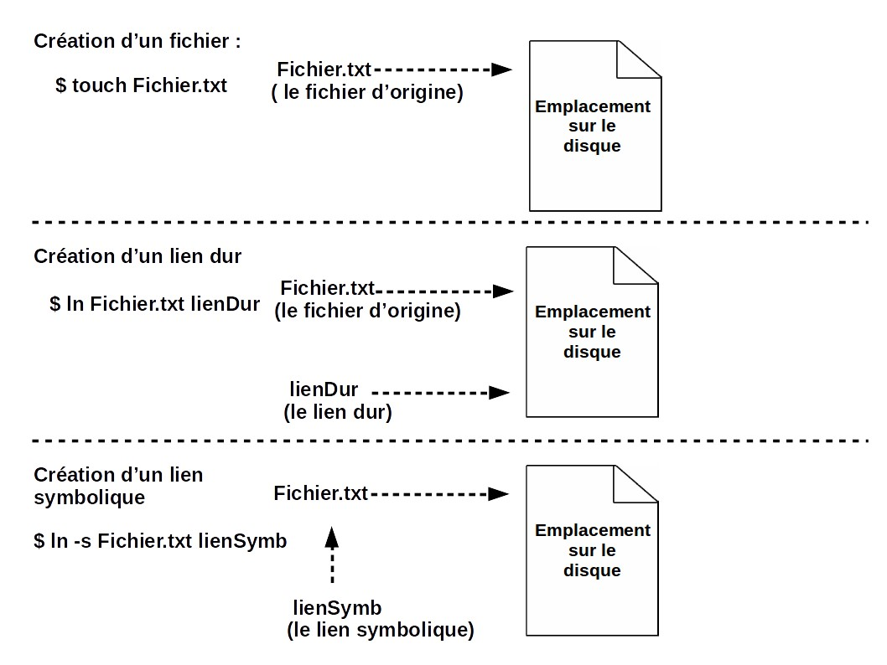
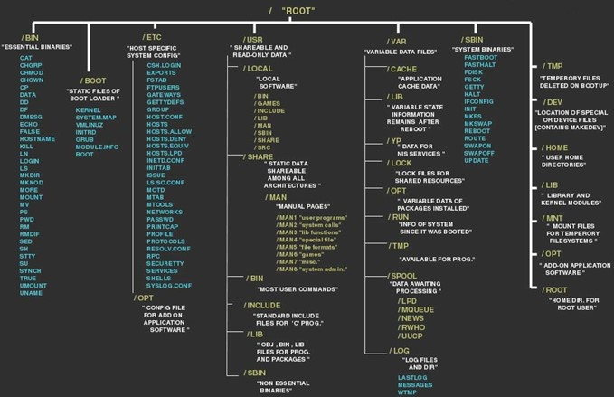

#Le Système de Gestion de Fichiers

---

## Pourquoi ?

On ne peut pas stocker d'informations de manière durable dans la RAM puisqu'elle est volatile, et de taille restreinte.  
Il faut donc organiser nos données qui doivent perdurer sur le Disque Dur, afin de pouvoir stocker de gros volumes, de pouvoir les partager etc ...

Le SGF définit :

- organisation cohérente de la mémoire secondaire

    !!! abstract ""
        Notion de **fichiers** et de **répertoires**  
        Les sous-répertoires sont des enfants d’un répertoire **racine**  
        On a donc un **==hiérarchie==**, où un répertoire peut en contenir d’autres.
 

- comment nommer les fichiers (caractères interdits, réservés, extensions etc ...)?
- comment les structurer ?
- comment les utiliser, les protéger ?

!!! warning "Important !"
    Sur un système UNIX : l'OS gère un fichier et un dossier de la **même manière** !  
    
    Un ==dossier== est un **fichier** qui **peut** en contenir d'autres.  
    Un ==fichier== simple est un **fichier** qui **ne peut pas** en contenir d'autres.  
    
    La distinction ne tient qu'à un attribut qui indique que le fichier en question est en fait un dossier.

---

## Inodes

Le SGF conserve une liste de tous les fichiers : la table des inodes.  

Un inode est un {==nœud d’information==} qui contient les **attributs** d'un fichier (jusqu'à 40+ sur certains OS !) :  

- type de fichier (fichier simple, répertoire, socket ...)
- propriétaire (user, group)
- permissions
- compteur de lien : nb de répertoires contenant une entrée avec ce numéro d’inode
- marques temporelles (date/heure création, date/heure modification)
- liste de blocs (liste des n° de blocs contenant le 1er segment du fichier)
- ...

!!! warning "Important !"
    Un inode ne contient **PAS** le nom du fichier.  
    Un fichier simple étant forcément dans un fichier de type répertoire, c'est le fichier répertoire qui contient les noms des fichiers qu'il contient !
    
    Cela permet d'avoir une table d'inodes de petites dimension, qui se parcourt rapidement :rocket: !      
    
---
 
## Types des fichiers


!!! tip
    On peut facilement voir le type d'un fichier en faisant la commande ``ls -l`` qui affiche le nom du fichier précédé de son type et droits d'accès :
        ```bash linenums="1"
        ls -l
        {==l==}rw-r--r-- 1 jberger 1049089 309 Oct 29 10:06 monLien -> SE/TP2/src/bonjour.c
        {==-==}rw-r--r-- 1 jberger 1049089  16 Oct 29 10:36 testRegexp
        {==d==}rwxr-xr-x 1 jberger 1049089   0 Oct 28 17:03 TP1/
        {==d==}rwxr-xr-x 1 jberger 1049089   0 Oct 28 17:03 TP2/
        ```
  
### Fichiers normaux :

!!! abstract ""
    Utilisés par les users  
    ^^Fichiers ASCII^^ :   
        :fontawesome-solid-arrow-right:  lignes de texte (caractère « fin de ligne » variable selon les SE)  
        :fontawesome-solid-arrow-right:  avantage = facilement lisibles et modifiables  
    ^^Fichiers binaires^^ :   
        :fontawesome-solid-arrow-right:  structurés pour que l ’on puisse retrouver ses informations.  

### Répertoires : 

!!! abstract ""
    Utilisés par les users  
    Fichiers de type particulier qui contiennent une **liste d’autres fichiers**
            
### Lien permanent : 

!!! abstract ""
    Entrée de répertoire normale qui au lieu de pointer vers un fichier unique, pointe sur un fichier déjà existant.  
    Permets de donner plusieurs noms à un fichier, dans des répertoires différents. Donc de le partager !  
    Ce fichier ne sera effacé que lorsque son dernier nom est supprimé (pas d’inode supplémentaire).
        
### Lien symbolique : 

!!! abstract ""
    Ne pointe pas vers un autre inode comme un lien permanent mais vers un  autre nom de fichier (inode supplémentaire).  
    :warning: Lors d'un parcours automatique de disque, on passera plusieurs fois au même endroit de la mémoire vu qu'il y a une nouvelle inode ... Peut perf !
    
!!! quote "Différence en image : "
    

### Socket : 

!!! abstract ""
    Moyen de communication avec d’autres machines via le réseau.
        
### Pipes nommés :

!!! abstract ""
    Moyen de communication entre processus d'une même machine.
         
### Fichiers spéciaux caractères : 
 
!!! abstract ""
    Offre un mécanisme de communication avec les pilotes de périphériques à raison d’un caractère à la fois.  
    Modélisation d’E/S (terminaux,imprimante ...) (Contenu non gardé en mémoire).

### Fichiers spéciaux bloc :

!!! abstract ""
    Offre un mécanisme de communication avec les pilotes de périphériques, similitude avec les fichiers spéciaux à caractère, mais avec une quantité de données plus importante.  
    Modélisation des disques (Contenu gardé en mémoire).

--- 

## Permissions sur les Fichiers

### Définition des Droits

!!! abstract ""
    Un fichier peut appartenir à un *utilisateur* qui lui-même fait partie d'un ensemble d'utilisateur (*groupe*) qui ont tous les mêmes droits sur une même machine.  
    
    Par exemple, il peut y avoir un groupe ``élèves`` et `profs` sur une même machine et les élèves connectés n'ont pas accès aux fichiers de correction !
    
    On va donc gérer les accès pour :  
    
    - Un User  
    - Un Groupe d'Users  
    - Les Autres  


!!! tip
    On peut facilement voir les droits d'accès à un fichier en faisant la commande ``ls -l``
        ```bash linenums="1"
        ls -l
        l{==rw-r--r--==} 1 jberger 1049089 309 Oct 29 10:06 monLien -> SE/TP2/src/bonjour.c
        -{==rw-r--r--==} 1 jberger 1049089  16 Oct 29 10:36 testRegexp
        d{==rwxr-xr-x==} 1 jberger 1049089   0 Oct 28 17:03 TP1/
        d{==rwxr-xr-x==} 1 jberger 1049089   0 Oct 28 17:03 TP2/
        ```
        
    Ici, l'utilisateur `jberger` en particulier peut lire et écrire le fichier `testRegexp`.  
    Les utilisateurs appartenant au groupe `1049089` peuvent uniquement le lire.  
    Idem pour tous les autres utilisateurs. 
        
### Modification des Droits

!!! abstract ""
    Le codage des droits est fait sous forme binaire (en puissances de 2), pour chaque bloc de permissions (user/group/others).  
    Ainsi le codage des droits ``rwxr-x---`` donne **750** :   
        - Droits  User : $2^2 + 2^1 + 2^0 = 7$   
        - Droits Groupe : $2^2 + 0 + 2^0 = 5$  
        - Droits Autres : $0 + 0 + 0 = 0$   
                     

!!! tip
    Pour modifier les droits, il existe la commande ``chmod``.  
    Elle permet de modifier avec la notation binaire, mais aussi en changent juste certains bits sur un set de droits :  
    ````
    chmod 750 toto.txt
    chmod u+rwx,g+rx,o-rwx toto.txt
    ````
    
    :warning: Avec la deuxième notation, les bits non mentionnés ne sont pas changés !!

---

## Hiérarchie

On a un système de catalogues : mémorisation des noms, attributs et adresses des fichiers.

La structure courante est une ==**arborescence de catalogues**==.



Un chemin d’accès est le moyen d'arriver à un fichier situé dans cet arbre.  

^^Chemin absolu^^ = à partir de la racine de l’arbre (ROOT)  
^^Chemin relatif^^ = à partir de la position courante dans l’arbre  
^^Chemin non linéaire^^ = permet de couper l'arborescence en suivant un lien  
 
Dans les SE UNIX Based :  
. = catalogue courant  
.. = catalogue père  
~ = répertoire de base d'un utilisateur


---

## Opérations sur les Fichiers

Ces opérations se font grâce à des appels systèmes (fonction disponible dans le noyau) :  

- CREATE (création d’un fichier vide)
- DELETE
- OPEN
- CLOSE
- READ (lecture de n octets à partir de la position courante)
- WRITE
- APPEND (écriture en fin de fichier)
- SEEK (indication de la position des données à lire/écrire)
- GET ATTRIBUTES
- SET ATTRIBUTES
- RENAME

---

## Stockage des fichiers

Comment le SE sauve-t-il le fichier sur le disque ?

### Allocation contiguë : 

!!! abstract ""
    Tous les blocs se suivent  
    :fontawesome-solid-arrow-right: méthode la plus simple mais coûteuse en espace disque
    
### Allocation «liste chaînée» : 

!!! abstract ""
    Chaque bloc contient l’adresse du bloc suivant  
    :fontawesome-solid-arrow-right: pas d’espace perdu mais accès aléatoire lent

### Allocation «liste chaînée indexée» : 

!!! abstract ""
    Regroupement des «adresses de bloc» dans une table (index) en mémoire [MS-DOS]  
    :fontawesome-solid-arrow-right: inconvénient : table entièrement en mémoire ...
