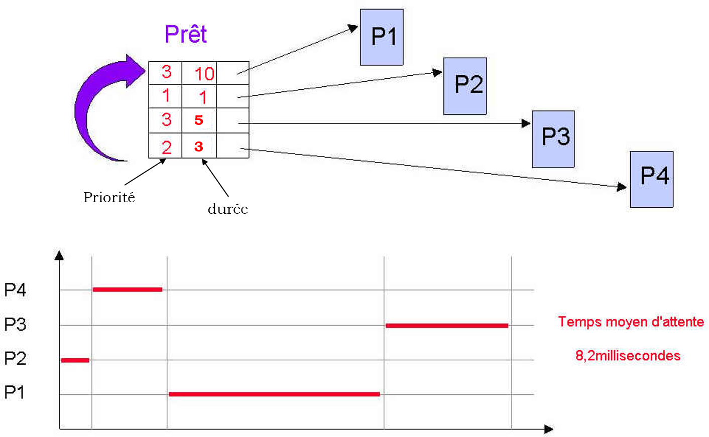
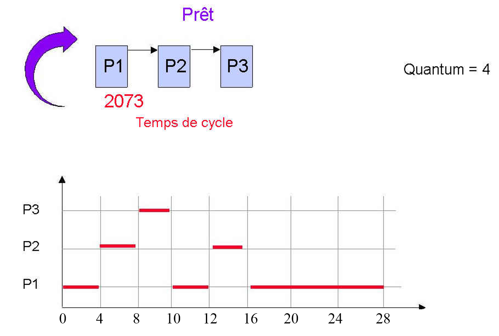
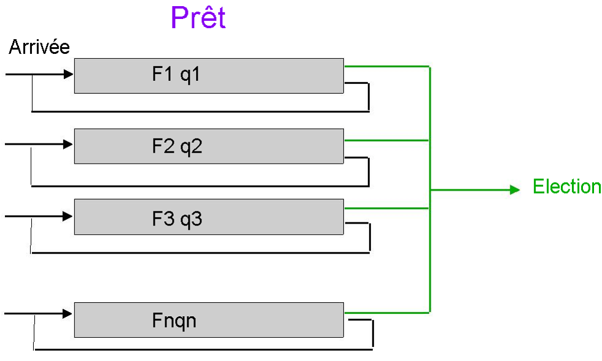
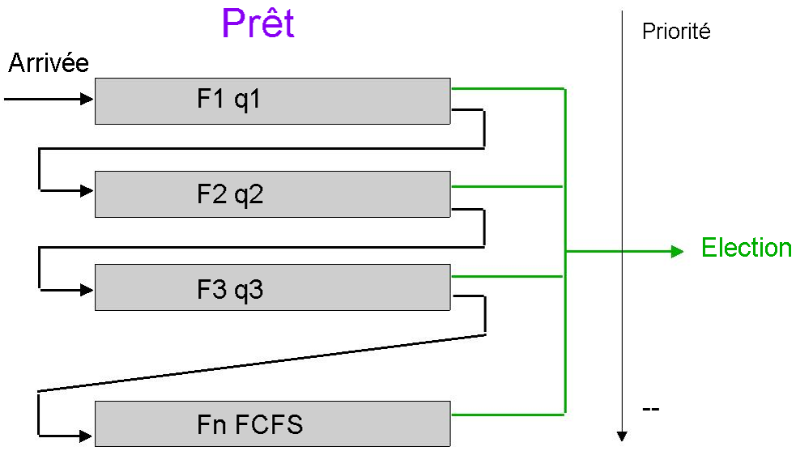

# Ordonnancement

---

## Généralités

Dans la vraie vie, plusieurs processus cohabitent et peuvent être prêts à être exécutés en même temps.  

Le SE doit faire un **choix** (selon un algorithme d'ordonnancement) :
 
- équité : chaque processus doit avoir du temps processeur 
- efficacité : le processeur doit être utilisé à 100% 
- temps de réponse : l 'utilisateur devant sa machine ne doit pas trop attendre 
- temps d'attente : les processus doivent démarrer le plus vite possible 
- temps d'exécution : une séquence d'instructions ne doit pas trop durer 
- rendement : il faut faire le plus de choses en une heure 

---

## Réquisition

Il existe deux grandes familles d'ordonnacement : 

### Ordonnancement sans réquisition (ou non préemptif)

!!! abstract ""
    Un processus est exécuté jusqu'à la fin (sauf si il se bloque lui-même).  
    :warning: inefficace et dangereux (ex: exécution d'une boucle sans fin...) 
    
### Ordonnancement avec réquisition (ou préemptif)

!!! abstract ""
    A chaque signal d'horloge, le SE reprend la main, décide si le processus courant doit céder sa place, et éventuellement donne le processeur à un autre processus.  
    Un processus perd le processeur s'il se bloque lui-même.  
    Il existe de nombreux algorithmes d'ordonnancement avec réquisition.
    
    

!!! tip ""
    C'est le **noyau** qui déclenche le passage de l'état **Elu** à l'état **Prêt** lors d'une réquisition.

---

## FIFO

!!! warning
    On remarque que l'ordre de passage change la donne ...
 

---
  
## Priorités
    
Chaque processus reçoit une priorité, le processus de plus forte priorité est élu avec ou sans réquisition.
    

---

## Round Robin (RR) ou "tourniquet"

Définition d'un **quantum** = tranche de temps.  
Un processus élu s'exécute au plus durant un quantum.  
A la fin du quantum, préemption et réinsertion en fin de file d'attente des processus prêts.

---

## Files de priorités

On définit des priorités constantes multi niveaux **avec ou sans extinction** de priorité.  
Chaque file est associée à un quantum éventuellement différent.  

### Sans extinction : 

!!! abstract ""
    Un processus garde toujours la même priorité.

### Avec extinction : 

!!! abstract ""
    La priorité d'un processus décroît en fonction de son utilisation de la CPU.

---

## SJF : Shortest Job First

Le plus court d'abord.

