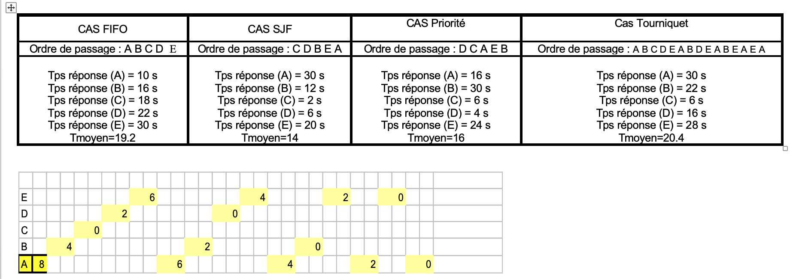
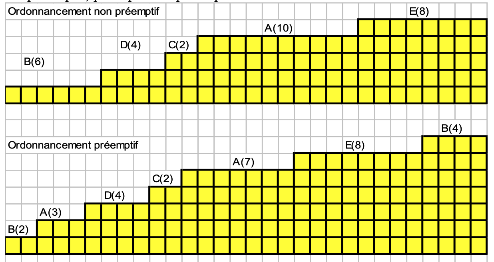
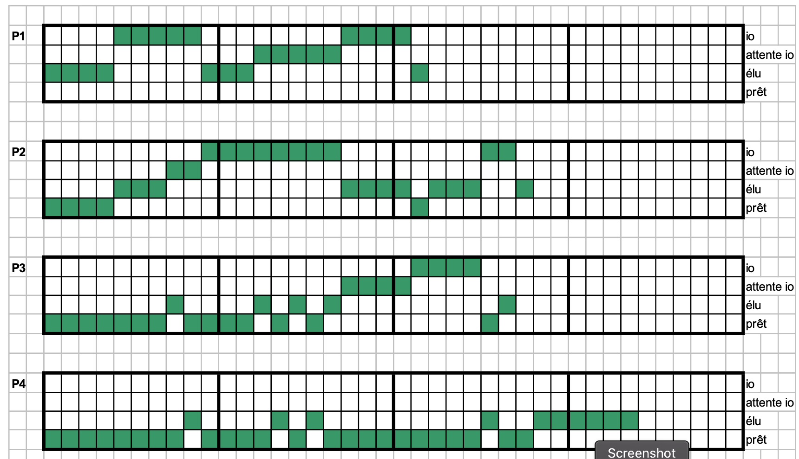

# TD Ordonnancement Correction

---

## Exercice 1 : Comparatif rapide

|   | **Windows** | **Linux** |
| --- | --- | --- |
| ``Noyau`` | C:\Windows\system32\ntoskrnl.exe | /boot/vmlinuz (lancé par Grub, on le voit dans la conf de Grub) |
| ``Protection`` | NON, n'importe quel utilisateur peut déplacer, effacer ou modifier ces fichiers | OUI, seul le super utilisateur a le droit d'agir sur ces fichiers. |
| ``Interpréteur de commandes`` | cmd | /bin/bash |
| ``Autres IC.`` | PowerShell | zsh, tcsh, sh, ksh, mc, … |
| ``Fonctionnalités de l'IC.`` |Traitement des fichiers, de répertoires et démarrage d'applications. Très peu d'applications peuvent être lancées en tache de fond|Traitement de fichiers, de répertoires et démarrage des applications. Le lancement d'application en fond de tache est possible|
| ``Utilitaires systèmes`` |Editeurs de texte, NOTEPAD, WORDPAD, edit sous MSDOS. Utilitaire de dessin (paint),navigateur Internet,lecture d'un CD audio,visionneuse d'images,calculatrice…|Editeurs de texte (vi, ed, pico), utilitaire de dessin, navigateur Internet,lecture d'un CD audio,visionneuse d'images,calculatrice…|
| ``Utilitaires de programmation`` | Aucun |compilateurs (gcc, java …), éditeur de liensn outils de développement : débogueur (gdb)|

---

## Exercice 2 : Ordonnancement simple

| Processus    | durée(s) | Priorité | **Soumis à (s)** |
| ------------ | -------- | ---------| ---------------- |
| `A`          | 10s      | 3        | **2s**           |  
| `B`          | 6s       | 5        | **0s**           |
| `C`          | 2s       | 2        | **5s**           |
| `D`          | 4s       | 1        | **5s**           |
| `E`          | 8s       | 4        | **3s**           | 

### Question 1

### Question 2

---

## Exercice 3 : Ordonnancement plus complexe

| P1                            | P2                            |     P3                             | P4                      |
| ----------------------------- | ----------------------------- | -----------------------------------| ----------------------- |
|  P1 Calcul pendant 40 ms      | P2 Calcul pendant 30 ms       | P3 Calcul pendant 40 ms            | P4 Calcul pendant 100 ms|
|  Lecture disque pendant 50 ms | Lecture disque pendant 80 ms  | Lecture disque pendant 40 ms       ||
|  Calcul pendant 30 ms         | Calcul pendant 70 ms          | Calcul pendant 10 ms               ||
|  Lecture disque pendant 40 ms | Lecture disque pendant 20 ms  |||
|  Calcul pendant 10 ms         | Calcul pendant 10 ms          |||

