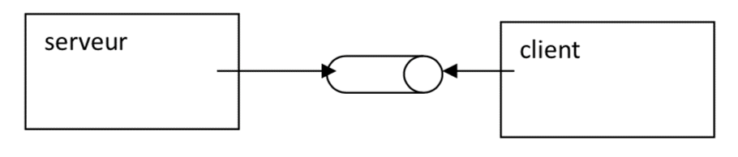
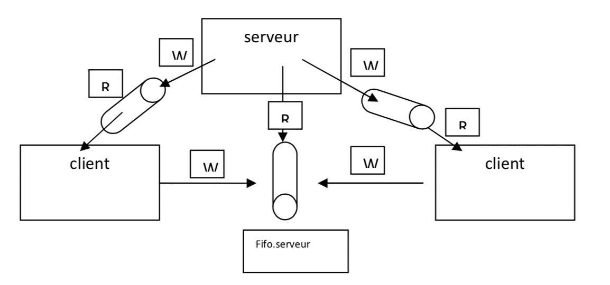

# Mini Projets : Sujet 2 - Server Q&A

---

## Sujet 2 – Serveur Q&A

Ce sujet est un peu plus complexe, c'est pourquoi un template d'itération (qui force un peu l'archi) est déjà établi.  
Charge à l'équipe de les ajuster à leur compétences afin d'arriver à un accord avec son client (le prof).  

### Itération 1

!!! warning ""
    - Un processus server active un client sur ==**une autre console**==  
    - Les 2 processus se parlent via un **pipe nommé** dont le nom est passé en paramètre au fils
    - Le processus serveur est en écoute sur le pipe
    - Le processus client lit des caractères tapés au clavier et les écrit dans le pipe
    - Quand le combo ``control + D ( EOF )`` est tapé au clavier , le client se termine
    - Le processus serveur ne se termine pas , il est toujours en attente d’un client éventuel
    - On peut relancer un client manuellement en lui donnant le nom du pipe et le logiciel fonctionne de nouveau.
    - Le processus serveur affiche les données reçues précédées du PID du client.

    


### Itération 2

!!! warning ""
    - Le programme server prends maintenant **2 paramètres**  
        - Le nom du pipe
        - Le nombre N de clients
    - Au démarrage il instancie N clients qui peuvent lui parler (**1 client = 1 shell**)
    - Des clients peuvent être crées manuellement en plus par la suite
    - On ^^protège^^ la mort du server par ``CTRL+C``
    - Le serveur sait répondre à des questions basiques des clients (fixées) :

        ````
        - Q : Qui suis-je ? -> R : Ecrit le PID du demandeur
        - Q : Qui es tu ? -> R : Je suis le serveur de PID 12234
        - Q : Qui est la ? -> R : liste des clients
        - ….
        ````

    


### Itération 3

!!! warning ""
    - Imaginez un serveur multiprocessus / multi threadé où le serveur, dès qu’il reçoit une demande, la passe à un processus qui la gère.
    - Comme cela il peut boucler et gérer d’autres demandes entrantes.