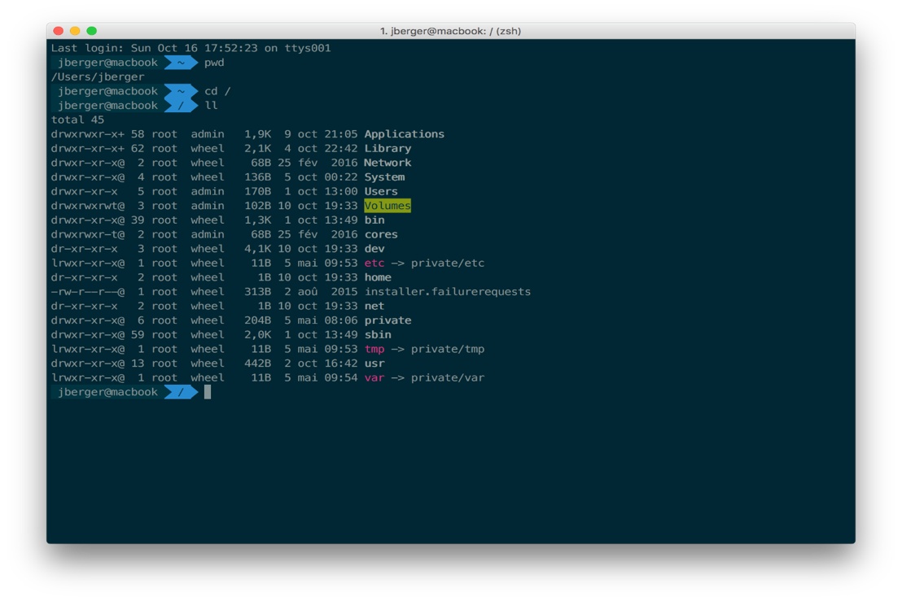

# Pourquoi UNIX ?

---

## Bonnes raisons

- De plus en plus répandu en entreprise
- Incontournable sur le systèmes TR
- Certaines utilisations nécessitent des contraintes de production fortes telles que :
    - la **disponibilité** (pas de reboot, pas d'arrêt)
    - la **performance** en charge (nombre d'utilisateurs, de processus)
    - la **pérennité** (car Unix est basé sur des standards)
    - la **stabilité / sécurité** (peu de bugs système)

---

## Difficultés

Une des principales difficultés d'Unix est son côté ligne de commande un peu démodé demandant un minimum d'investissement avant de pouvoir s'en servir efficacement.  

!!! tip "" 
    Ce type d'interface reste pourtant inégalé depuis 30 ans !  
    
    
Il existe depuis plus de dix ans des interfaces graphiques comparables au système Windows.  
Maintenant, les environnements graphiques sous Linux n'ont rien à envier aux systèmes de Microsoft.  

---

## Caractéristiques

- Système ouvert (pas de code propriétaire ; seules certaines implémentations sont propriétaires).  
- Multi-tâches (plusieurs programmes peuvent s'exécuter en même temps, sans blocage).  
- Multi-utilisateurs (plusieurs utilisateurs travaillent sur la même machine en même temps), gestion des droits.  
- Mémoire protégée (pas d'interaction entre les programmes) et virtuelle (le système peut utiliser plus de mémoire que la mémoire physique disponible).  
- Interface graphique et shell (interpréteur de commande).  
- Plusieurs centaines d'outils (manipulation de texte, développement de logiciels, communication etc...).  


---

## Résumé en vidéo
 
<div class="video-wrapper">
<p align="center">
<iframe width="560" height="315" src="https://www.youtube.com/embed/opBSsNDnAc4" frameborder="0" allow="accelerometer; autoplay; clipboard-write; encrypted-media; gyroscope; picture-in-picture" allowfullscreen></iframe>
</p>
</div>


---

## Le Shell

Comme tout système d'exploitation, UNIX possède un **Interpréteur de Commandes (I.C.)**.   

C'est un processus utilisateur comme les autres.  

Il permet : 

- l’exécution des programmes
- la manipulation des fichiers
- l'accès aux périphériques de l’ordinateur
- l'automatisation des procédures par fichiers de commandes (scripts en langage Shell) ...



Ce **"logiciel d'interface"** fournit à l'utilisateur un ensemble de commandes qui lui permettent de "dialoguer" avec le système lui-même, le noyau (kernel).   

!!! tip
    UNIX propose en standard plusieurs shell possibles :
    
    - SH
    - BASH
    - ...

Chaque shell peut être lancé (activé) par sa commande équivalente (bsh, ksh, csh). 

Par défaut l'utilisateur lorsqu'il se connecte se retrouve automatiquement dans l'un de ces shell, il a donc un login -shell, configuré dans le fichier ``/etc/passwd``

Le shell est donc un pseudo langage qui :
 
- interprète vos commandes 
- détermine les fichiers responsables de la mise en place de votre environnement  

!!! warning
    En BASH, le fichier de configuration du terminal est ~/.bashrc  ou ~/.bash_profile

!!! tip
    Il se nomme ainsi (coquille) car il enveloppe le noyau Unix, toutes les commandes sont passées au noyau à travers votre shell.

---

## Le Home Directory : ~

Vous êtes sous votre HOME quand vous êtes sous ``/home/{==your_login==}``  

C'est un espace disque qui vous appartient, **à vous et à vous seul** (voir "droits").   
Normalement vous pouvez écrire et lire tous les fichiers qui s'y trouvent.   
Vous êtes responsable de tout ce qui s'y passe (piratage, saturation des espaces disques, etc...).   

---

## Notion de comptes utilisateur

Pour chaque compte vous avez :

- un login (uid)  
- un mot de passe associé  
- un groupe (gid)  
- un home directory (répertoire de travail)  
- un langage de commandes (shell)

!!! tip
    Dans un système UNIX, ces infos sont regroupées dans deux fichiers :  
    
    ```bash linenums="1"
    cat /etc/passwd
    
    cat /etc/group
    ```

---

## Connexions

### Locale

Dès que vous êtes en local, vous pouvez saisir votre login puis votre password sur l'écran (attention unix est « case sensitive »).  
Deux cas peuvent arriver :  

- Soit un écran noir avec un simple prompt ">"  
- Soit un environnement graphique avec une gestion de la souris et des fenêtres suffisamment explicites pour démarrer.  

!!! warning
    Pour sortir d'une session, il est impératif d'utiliser les procédures de déconnexion.   
    En effet, Unix (comme d'autres systèmes) a besoin de sauvegarder certaines données (flush des buffers lors de la fermeture des fichiers), démontage des disques pour forcer une mise à jour des fichiers systèmes, etc.   
    Aussi si vous faites un "power off" d'une machine Unix, vous risquez d'endommager les fichiers sur les disques.   
    Vous devez faire un ==**exit**== pour revenir à la fenêtre primaire, puis éventuellement un halt pour arrêter le système (si vous êtes autorisé à le faire).


### Distante

Pour la connexion à distance, vous avez bien sûr besoin d'être déjà sur un ordinateur Unix/Windows ou autre et d'établir un lien vers la machine Unix cible.   
Chaque type de connexion dépend de la plate-forme d'origine.  
La plus répandue est ==**SSH**==, mais on trouve encore du **telnet**.  

!!! tip
    Les outils le splus connus de SSH sont "PuTTY" et "MobaXterm".
