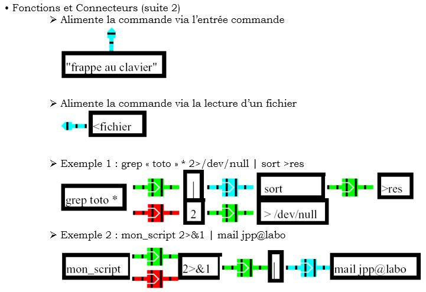

# Théorie des commandes

---

## Structure

Un **commande** est en fait un ==programme compilé==, souvent en C, accessible partout dans l'OS.  
Comme tout programme classique, il peut recevoir des paramètres de l'extérieur.  
Dans l'IC, on a cette structure

```bash linenums="1"
nom_de_la_commande param1 param2 param3 ...
```

!!! tip 
    La commande est chacun de ses paramètres sont séparées par des **ESPACES**
    
---

## Gestion des Flux

### Théorie




### Exemples

```bash linenums="1"
cat < toto

ls > dir.txt

ls >> dir.txt

rm * 2> erreur.log

rm * 2>> erreur.log

ps –ef|grep toto

```
