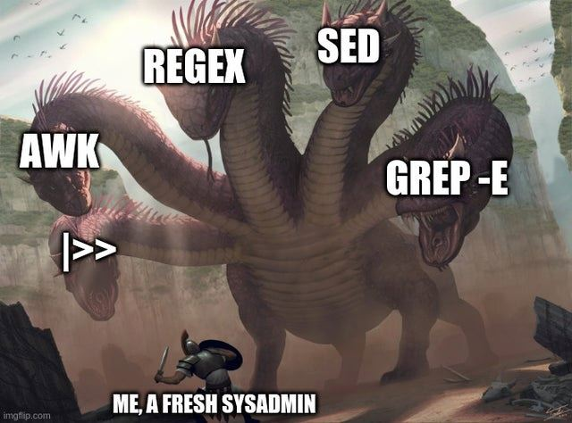
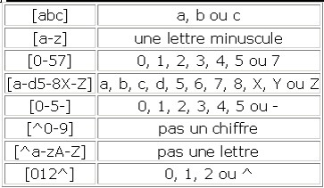
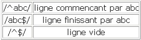
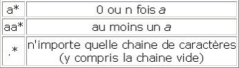
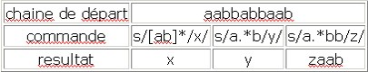
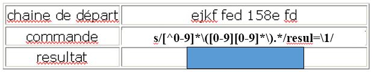
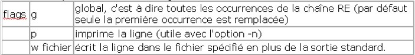
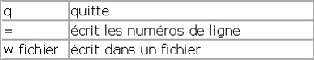
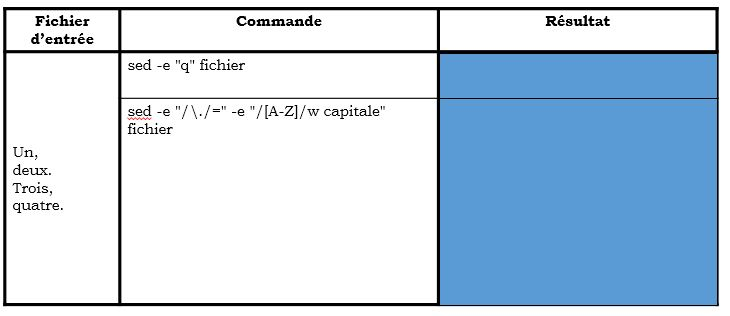

# Expressions Régulières

---

## Généralités

!!! abstract ""
    Les expressions régulières, combinées à des fonctions de certains langages (PHP, bash, JavaScript et même HTML5 !) permettent de faire des recherches et de la reconnaissance sur des chaines de caractères.   
    Extraire des numéros de téléphone d’une page web, ou vérifier que l’email que rentré dans un formulaire, ressemble bien à un email…   
    C’est très puissant !
    



    
---

## Anatomie d'une REGEX

!!! abstract ""
    Une regex est faite pour effectuer des recherches dans les chaînes de caractères… et une regex est elle-même une chaîne de caractère !   
    
    Elle possède un ==**délimiteur**== qui en indique le **début** et la **fin** ainsi que des ^^caractères spéciaux^^.   
    
    Les caractères spéciaux permettent d’indiquer des comportement prédéfinis.   
    Par exemple désigner un sensemble caractères, indiquer la longueur d’un mot, une longueur variable, indiquer qu’on ne veut que des majuscules, un mot optionnel etc.
    
    Une fois la regex créé, chaque langage de programmation dispose de ses propres fonctions pour les utiliser.   
    Certaines fonctions permettent de contrôler la présence de certains éléments dans une chaîne, de la nettoyer en supprimer certains éléments ou encore d’extraire du texte depuis une chaîne.

!!! warning ""
    Lorsqu'on recherche une chaîne de caractères à l'aide d'une expression régulière, la chaîne renvoyée est la chaîne la plus grande correspondant à l'expression.  
    
    Pour ==**banaliser**== un caractère, il faut utiliser **\\** 
    

^^Exemple^^ :  

````bash
sed -e "s/RE/chaîne de remplacement/g" file 
````
    
---
    
## POSIX et PCRE

!!! abstract ""
    Lorsque l’on parle de REGEX, il faut savoir qu’on peut rencontrer différentes variantes.   
    
    En effet, certains masques ne fonctionneront pas forcément sur toutes les plate-formes et dans tous les langages.
    
    POSIX est un standard qui a cherché à uniformiser les syntaxes et les fonctionnalités des expressions régulières.   
    Les expressions de type POSIX seront plutôt bien supportées dans la console Linux par exemple.
    
    Cependant, leur support étendu (le reste étend commun avec PCRE) est plus restreint.   
    PHP ne supporte par exemple plus la syntaxe POSIX dans ses dernières versions.
    
    PCRE désigne un type de REGEX qui s’appuie sur la syntaxe des REGEX du Perl. C’est la syntaxe la plus largement supportée aujourd’hui.  

--- 

## Délimiteurs

!!! abstract ""
    Ce sont les caractères ```#```, ```%```, ```/``` etc...
    
    Ils servent à **délimiter** ce qui fait parti de votre expression, de ce qui n’en fait pas parti. C’est donc en dehors des délimiteurs que vous placerez les options PCRE, POSIX n’ayant pas d’options, ni de délimiteurs d’ailleurs.  

!!! tip 
    Le choix du délimiteur est totalement libre (dans la mesure où c’est un caractère spécial), cependant, prenez un caractère assez rare.   
    
    Inutile de tenter d’utiliser un slash ``/`` si vous pensez travailler sur des URL ou commentaires C ...

---

## Les métas-caractères

!!! abstract ""
    Ces caractères ont chacun une signification spéciale dans les expressions régulières.  
    C’est notamment eux qui font la force des REGEX.

| Signe                | Signification                                             | Exemple                                            |
| -------------------- | --------------------------------------------------------- | --------------------------------------------------------- |
| `^`                |    marque un début chaine      | /^music/ (commence par music) |
| `$`   | marque une fin de chaine                                   |                    /^music$/ (commence et termine par music) |
| `|`   |     connecteur logique ou                               |   `/music | musique/` (music ou musique)                 |
| `.`   |    tous les caractères sauf les retour charriot \n (il faut pour ça utiliser l’option s)                                |   /./ (match presque tout)                 |
| `\`   |       caractère d’échappement                             |           /\\^/ (signifie que le “^” compte ici comme un caractère normal)         |

---

## Quantificateurs

!!! abstract ""
    Les quantificateurs permettent de préciser le nombre de fois que l’on autorise un caractère ou une suite de caractères à se répéter.

| Signe                | Signification                                             | Exemple                                            |
| -------------------- | --------------------------------------------------------- | --------------------------------------------------------- |
| `?`                |    0 ou 1 fois      | /bue?no/ (buno, ou bueno) |
| `+`   | 1 ou plus                                  |                    /bue+no/ (bueno, bueno, bueeeeeeno…) |
| `*`   |     0, 1 ou plus                               |   /bue*no/ (buno, bueno, bueeeeeeno…)                |

---

## Classes et intervales

!!! abstract ""
    Les classes permettent de recherche entre plusieurs caractères différents, elles donnent des alternatives.  
    Les intervales sont des classes un peu spéciales puisqu’elles permettent d’énumérer une certaine palette de chiffre ou de lettres.   
    Par exemple, tous les chiffres de 0 à 5, ou toutes les lettres de a à i, sans les énumérer une par une.

| Signe                | Signification                                             | Exemple                                            |
| -------------------- | --------------------------------------------------------- | --------------------------------------------------------- |
| `[ ]`                |    classe de caractères      | /gr[oai]s/ (gros, gras ou gris) |
| `[ - ]`   | intervalle de classe                                  |                   /n°[0-9]/ (n°1, n°2, […] n°9) |
| `[^ ]`   |     classe à exclure                               |   /h[^3-9]/ (h1 et h2 uniquement)               |


!!! warning ""
    Dans un classe, le tiret “-“ sert de délimiteur, donc si on veut l’inclure en tant que caractère, on doit le placer en fin de classe (ou au début).  
    
    Par ailleurs, le crochet fermant “]” délimite aussi la fin de le classe, il faudra donc l’échapper par un antislash.

!!! warning ""
    En revanche, les autres métas-caractères ne comptent pas dans les classes.  
    On ne les échappe pas.  
    Cette classe [0-9a-z?+*{}.] correspond donc à un chiffre, une lettre, un point d’interrogation, un point, un plus…
 
---
    
## Classes abrégées

!!! abstract ""
    Les classes abrégées permettent, comme les classes “normales”, d’avoir de nombreuses possibilités.  
    Elles n’apportent rien de plus en fonctionnalité que les classes normales, mais elles permettent d’écrire tout ça bien plus vite, ce sont des raccourcis !  

!!! success ""
    Que diriez vous si vous pouviez taper \w à la place de [0-9a-zA-Z_] ? :wink:

| Raccourci                | Signification                                             |
| -------------------- | --------------------------------------------------------- | 
|\d|	Indique un chiffre. Ca revient exactement à taper [0-9]|
|\D|	Indique ce qui n’est PAS un chiffre. Ca revient à taper [^0-9]|
|\w|	Indique un caractère alphanumérique ou un tiret de soulignement. Cela correspond à taper [a-zA-Z0-9_]|
|\W|	Indique ce qui n’est PAS un caractère alphanumérique ou un tiret de soulignement. Ca revient à taper [^a-zA-Z0-9_]|
|\t|	Indique une tabulation|
|\n|	Indique une nouvelle ligne|
|\r|	Indique un retour chariot|
|\s|	Indique un espace blanc (correspond à \t \n \r)|
|\S|	Indique ce qui n’est PAS un espace blanc (\t \n \r)|
|.|	Le point indique n’importe quel caractère ! Il autorise donc tout !|

---   

## Exemples  







---

## Exercices


??? example "Solution"
    

---

## Capture et références

!!! abstract ""
    Les ```\( \)``` sont capturantes.  
    
    Qu’est-ce que cela veut dire ? Ça veut dire qu’une expression mise entre parenthèse est automatiquement placée dans une variable à laquelle ont peut faire référence ailleurs.

On peut faire référence aux expressions capturées à deux endroits :  

- Dans la REGEX elle-même, cela s’appelle une backreference ou référence arrière.   
  On peut ainsi sélectionner les palindromes de trois lettres (mots qui se lisent indifféremment de gauche à droite ou de droite à gauche) avec cette expression ```/\(\w\)\w\1/```.  


    !!! tip
        Le marqueur ```(\w)``` sélectionne tout caractère alphanumérique et capture ce caractère, suivi d’un autre caractère puis du caractère précédemment capturé (donc l’expression entre parenthèses, soit la première lettre sélectionnée)
      
    Il peut y avoir plusieurs backreferences dans une même expression, la première est indiquée par ``\1``, la seconde ``\2`` et ainsi de suite.

- Dans le résultat retourné par la fonction invoquée. Ici, cela dépend du langage et de la fonction utilisée.   
  Par exemple en Bash :  

---

## Exercices



??? example "Solution"
    


---

## Outils 

En bash nous utiliserons les commandes ``vi`` et ``sed`` pour manipuler les regex. 

### Vi

#### Recherche 

On peut rechercher des chaines de caractères en utilisant des regexp :   
`:/regexp/` 

#### Commande

##### Substitution

On peut utiliser la commande de substitution :   
`:%s/regexp/chaine de remplacement/options`


### Sed

Sed est un éditeur non interactif.   
Cette commande permet d'appliquer un certain nombre de commandes sur un fichier puis d'en afficher le résultat (sans modification du fichier de départ) sur la sortie standard. 

#### Syntaxe 
  
````
sed [-n] [-e commande] [-f fichier de commandes] [fichier] 

-n écrit seulement les lignes spécifiées (par l'option /p) sur la sortie standard 
-e permet de spécifier les commandes à appliquer sur le fichier. 
-f les commandes sont lu à partir d'un fichier. 
````


#### Principe de fonctionnement   

Pour chaque ligne , on applique la commande (si cela est possible) puis on affiche sur la sortie standard la ligne modifiée ou non. 

#### Commandes

##### Substitution

````
ad1,ad2s/RE/remplacement/flags

-> Remplace les expressions régulières RE par la chaîne de remplacement entre les lignes ad1 à ad2 
````



##### Négation

````
ad1,ad2 !fonction argument 

-> La fonction est appliquée à toutes les lignes qui ne correspondent pas à la caractérisation
````

##### Suppression

````
ad1,ad2d

-> La commande de suppression **d** efface les lignes (au niveau de la sortie, le fichier d'origine n'est pas modifié)
````

^^Exemple^^ :    
- ``sed "1,10d" fichier`` : sortie du fichier à partir de la onzième ligne  
- ``sed "/^From/!d" fichier`` : On efface tout sauf les lignes commençant par From , donc on imprime les lignes commençant par From.  

#### Insertions




---

## Exercices



??? example "Solution"
    

---

# Conclusion

Peu importe votre domaine de programmation et le langage utilisé, tôt ou tard les regex sont l’outil qu’il vous faut.   

Enfin, gardez à l’esprit que de la même manière que du code, on n’obtient pas forcement la bonne solution du premier coup, alors testez !    