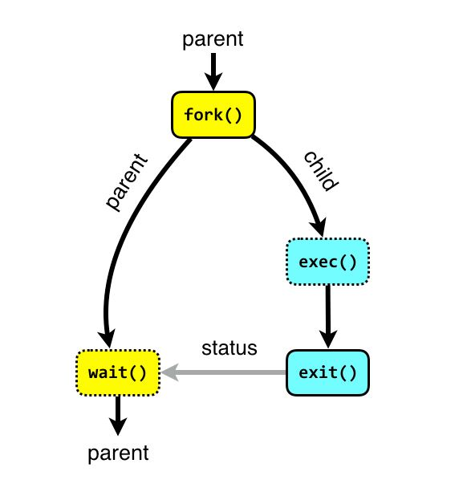

# Programmation Système - Execv

---

## Recouvrement

On va maintenant chercher à coder nos **deux processus** dans ==**deux programmes**== différents, afin d'alléger la lecture du code !

### Primitive de Recouvrement

#### Execv

```c linenums="1"
int execv(char *ref, char *argv[]);
```

````
ref : chemin absolu du programme à executer  
argv: tableau de pointeur vers des caractères (tableau de chaines de caractères)
        – argv[0]: nom du nouveau programme à exécuter
        – argv[1]: le 1er paramètre
        – argv[2]: le 2ème paramètre
        – ………….
        – argv[N]: le Nième paramètre
        – argv[N+1]: NULL
````
    
!!! abstract ""
    Permet de lancer l’exécution, par le processus appelant, d’un nouveau programme en son sein :
    
    - les instructions du nouveau programme ==**recouvrent**== celles de l ’ancien programme  
    - retourne -1 en cas d’échec
    
!!! warning "Important !"
    ^^Remarque^^ : **pas de création de nouveau processus**
    
    
!!! tip "Rien n'est fait au hasard ..."
    Si on regarde bien, on a déjà manipulé un tableau similaire dans la fonction ``main`` du programme calculatrice ...  
    Dans ce dernier, les arguments venaient de notre input en CLI, et c'est l'OS qui se chargeait de remplir le tableau pour nous.  
    
    Ici, nous remplaçons l'OS pour instancier manuellement un processus dans un existant.  
    **C'est donc à nous de remplir ce tableau cette fois ci !!**
    





--- 

## Exemple

### Code

<table border="0">
<tr>
    <td>
        Programme principal :
    </td> 
    <td>
        Programme fils :
    </td>
</tr>

<tr>
    <td>
        ```c hl_lines="5 10 13"
        /* calcul.c */
        int main(void)
        {
            int pid, status; char *argv[2];
            pid = fork();
            if (pid == 0) {
                printf("je le fils:pid=%d ",getpid());
                argv[0]="carre";
                argv[1]=NULL;
                execv(" /home/carre ",argv);
            }
            printf(" je suis le père: pid=%d ",getpid());
            wait(&status);
            printf (" le carre = %d ",status/256);
            exit(0);
        }
        ```
    </td>
    <td>
        ```c hl_lines="10"
        /* carre.c*/
        int main(int argc, char *arg[])
        {
            int x;
            printf(" je le fils:pid=%d ",getpid());
            printf("pid de mon pere=%d ",getppid());
            printf(" x = " );
            scanf (" %d ", &x);
            x = x * x:
            exit(x);
        }
        ```
    </td>
</tr>
</table>


### Schéma


      