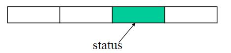
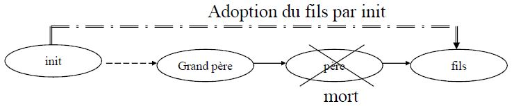

# Programmation Système - Fork

---

## Rappels : Programme vs. Processus

!!! warning "important"
    
    - ^^Programme^^ : entité **statique**, une suite d'instructions compilées
    - ^^Processus^^ : entité **dynamique**, possède un PID, c'est l'éxecution d'un programme. Possède un **contexte** propre.

---

## Création d'un Processus

^^Règle d'Or^^ : **tout** processus UNIX peut créer un ou plusieurs processus. 

!!! abstract ""
    Donc pour créer un processus nouveau, il en faut déjà un exustant ... qui va être **cloné**, puis **spécialisé**.   
    Il y a donc une ^^filiation^^ entre les processus !
    
    


### Primitives

#### PID Courant
    
```c linenums="1"
pid_t getpid(void);
```
    
!!! abstract ""
    Retourne le pid du processus courant (appelant)
    
#### PID du Père

```c linenums="1"
pid_t getppid(void);
```
    
!!! abstract ""
    Retourne le pid du père du processus courant (appelant)
    

!!! tip 
    Le pendant en Shell serait la commande : ``ps`` :wink:
    
#### Suspension

```c linenums="1"
int sleep (int nb_sec);
int usleep (int nb_msec);
```
    
!!! abstract ""
    ``sleep`` endort le processus jusqu'à ce que nb_sec secondes se soient
    écoulées, ou jusqu'à ce qu'un signal non-ignoré soit reçu.  
    
    ``usleep`` endort le processus jusqu'à ce que nb_msec micro-secondes se
    soient écoulées, ou jusqu'à ce qu'un signal non-ignoré soit reçu.
    
!!! danger ""
    Renvoient zéro si le temps prévu s'est écoulé, ou le nombre
    de secondes (micro-secondes) restantes si un signal a
    réveillé le processus.  
    
    
#### Création de processus

```c linenums="1"
pid_t fork(void);
```

!!! abstract ""
    Permet la création dynamique d’un nouveau processus <span style="color:green">(fils)</span>.
    par duplication du processus courant <span style="color:red">(père)</span>.  
    
    Le processus <span style="color:green">fils</span> ne **diffère** du processus <span style="color:red">père</span> 
    que par les ==**pid**== et ==**ppid**==.  
    
    Les 2 processus (<span style="color:red">père</span> et <span style="color:green">fils</span>) s’exécutent de manière
    ==**concurrente**== !

!!! tip
    Bibliothèques :   
    
    ```#include <sys/types.h>```   
     ``#include <unistd.h>``

!!! danger ""
    Retourne un entier :

    1. En cas de succès:  

        - 0 dans le fils
        - **pid du fils dans le père**

    1. En cas d’échec   

        - -1 dans le père
        - le fils n’est pas créé

!!! tip "Très Important !"
    La valeur retournée par fork permet donc de faire la **distinction** entre le père et le fils !
    


--- 

## Exemple basique


```c linenums="1" hl_lines="4"
int main(void)
{
    pid_t pid;
    pid = fork();
    
    if (pid == 0)
        printf(" Je suis le FILS ");
    else
        printf(" Je suis le PERE ");
    
    return 0;
}
```

!!! abstract ""
    Après fork : 
    
    - allocation d’une entée dans la table des processus au nouveau processus
    - allocation d ’un pid au nouveau processus
    - duplication du contexte du processus père (données, pile…)
    - retour du pid du processus fils à son père et 0 au processus fils
    
    
Affichons les PID respectifs :  

<table border="0">
<tr>
    <td>
        Dans le ==père== (PID supposé : 1234) :
    </td> 
    <td>
        Dans le ==fils== (PID supposé : 2345):
    </td>
</tr>

<tr>
    <td>
        ```c hl_lines="11 12"
        int main(void)
        {
            pid_t pid;
            pid = fork();
        
            if (pid == 0)
            {
                printf(" Je suis le fils");
                printf(" mon pid est = %d ",getpid());
            } else {
                printf(" Je suis le pere ");
                printf(" mon pid est = %d ",getpid());
            }
        }
        ```
    </td>
    <td>
        ```c hl_lines="8 9"
        int main(void)
        {
            pid_t pid;
            pid = fork();
        
            if (pid == 0)
            {
                printf(" Je suis le fils");
                printf(" mon pid est = %d ",getpid());
            } else {
                printf(" Je suis le pere ");
                printf(" mon pid est = %d ",getpid());
            }
        }
        ```
    </td>
</tr>
</table>

Affichages : 

```shell linenums="1"
Je suis le pere mon pid est = 1234
Je suis le fils mon pid est = 2345
```

!!! abstract ""
    PID différents: 1234 et 2345  
    Les 2 processus exécute **le même programme** !

!!! warning ""
    On ne peut pas prédire l'ordre des ``printf`` !! 
    
---    
    
## Synchronisation

### Primitives

#### Exit

```c linenums="1" hl_lines="8 9 10"
void exit(int status);
```    

!!! abstract ""
    Exit : 
    
    – termine le processus appelant.  
    – transmet la valeur de status (le ==**mot d’état**==) au processus père  
    – ferme les descripteurs de fichiers ouverts  
    – un signal ==**SIGCHLD**== est envoyé au processus père.
    

#### Wait

```c linenums="1" hl_lines="8 9 10"
pid_t wait(int *status);
```    

!!! abstract ""
    Wait : 
    
    – ==**attend**== la *terminaison ou l'arrêt* d'un processus fils (fils *quelconque*).  
    – retourne le PID d'un processus terminé, -1 en cas d’erreur (si tous sont déjà terminés).  
    – **stocke** la valeur transmise par le fils (exit) dans l'entier pointé par status.
    
    
!!! warning 
    Le status est codé sur le 2ème octet de l'int pointé :
    
    


--- 

## Exemple complet

<table border="0">
<tr>
    <td>
        Dans le ==père== (PID supposé : 1234) :
    </td> 
    <td>
        Dans le ==fils== (PID supposé : 2345):
    </td>
</tr>

<tr>
    <td>
```c hl_lines="10 11 12 13"
int main(void)
{
    int pid, status;
    pid = fork();
    
    if (pid == 0) {
        printf(" Je suis le fils");
        exit(3);
    } else {
        printf(" Je suis le pere ");
        printf(" j ’attends la fin de mon fils);
        wait(&status);
        printf("  status = %d ",status>>8);
    }
  return 0;
}
```
    </td>
    <td>
```c hl_lines="7 8"
int main(void)
{
    int pid, status;
    pid = fork();
    
    if (pid == 0) {
        printf(" Je suis le fils");
        exit(3);
    } else {
        printf(" Je suis le pere ");
        printf(" j ’attends la fin de mon fils);
        wait(&status);
        printf("  status = %d ",status>>8);
    }
  return 0;
}
```
    </td>
</tr>
</table>


Affichages : 

```shell linenums="1"
Je suis le fils
Je suis le pere 
  j ’attends la fin de mon fils 
  status = 3
```

!!! warning ""
    On ne peut pas prédire l'ordre des 3 premiers ``printf``.   
    Par contre on sait forcément que l'affichage du ``status`` se fera en dernier !
    
    
!!! abstract ""

    - Lorsqu’un processus se termine ({++exit++}), le système détruit son contexte, **sauf son entrée de la table des processus**  
    - Le procesus est alors dit dans un état ==**ZOMBI**==  (momentané si bien codé)
    - Le processus père récupère la mort de son fils ({++wait++}), et **détruit** son entrée de la table des processus.   
    - Le fils disparaît complètement du système (n’est plus zombi).  
    
    
    La communication entre le fils zombi et le père s ’effectue par le biais d ’un signal transmis du fils vers le père (signal **SIGCHLD** : la mort du fils).  
    
    Un processus fils défunt **reste zombie** jusqu’à ce que son **père ait pris connaissance de sa mort** (wait).  
    
!!! danger
    **Une mauvaise synchronisation = saturation table des processus = blocage total du système !**

---

##  Adoption



!!! abstract ""
    Si le père décède avant le fils alors le fils deviendra ==**orphelin**== et sera **adopté** par le processus de PID 1 (init).
    
    
---

## Exemple de Zombi

!!! warning 
    Ceci est un code faux ... à des fins pédagogiques !
    

```c linenums="1"
/*Programme pgmzombi.c */
int main(void)
{
    int pid, status;
    pid = fork();
    if (pid == 0) {
        printf(" je suis le FILS pid = %d\n ",getpid());
        sleep(10);
        printf(" je suis le FILS, à dieu\n");
    } else {
        printf("je suis le PERE pid = %d\n",getpid());
        printf("je suis le PERE je boucle à l’infini ");
        for ( ; ; );
    }
  return 0;
}
```  

On suppose que le pid du père est 1234 et celui du fils est 2345.

Résultat de l’exécution en arrière-plan:

```shell
> pgmzombi &
    je suis le pere pid =1234
    je suis le pere je boucle à l’infini

    je suis le fils pid =2345
    je suis le fils, à dieu
```

<table border="0">
<tr>
    <td>
        Avant la mort du fils : 
    </td> 
    <td>
        Après la mort du fils :
    </td>
</tr>

<tr>
    <td>
        ```shell
        # ps
            1234 tty3 0:04 pgmzombi
            2345 tty3 0:03 pgmzombi
        ```
    </td>
    <td>
        ```shell  
        # ps
            1234 tty3 0:04 pgmzombi
            2345 tty3 0:03 [defunct]
        ```
    </td>
</tr>
</table>

     
---

## Exercice - Zombi War

Copiez/Collez ce programme Zombi. Observez vous même le Zombi.   
Enfin, corrigez le code afin de le rendre propre ! 